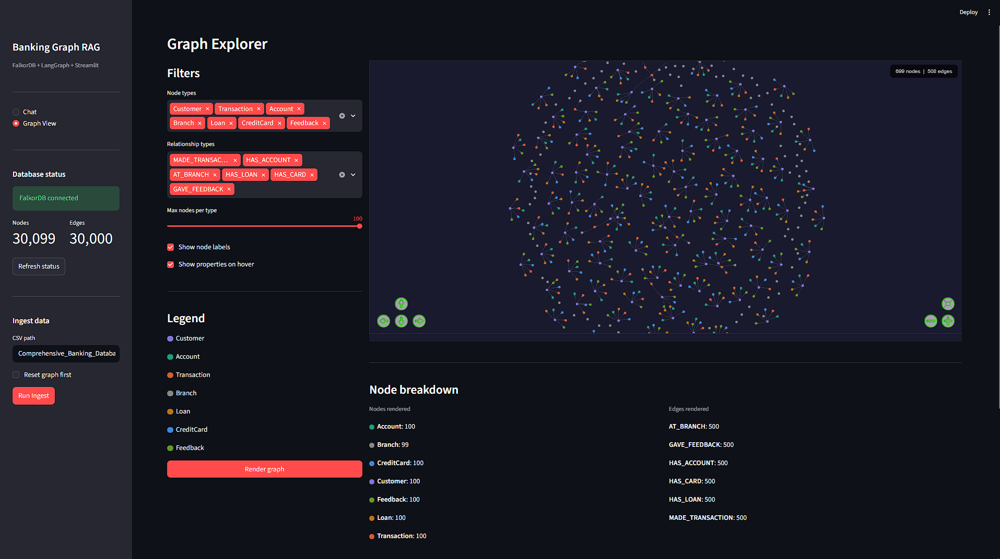
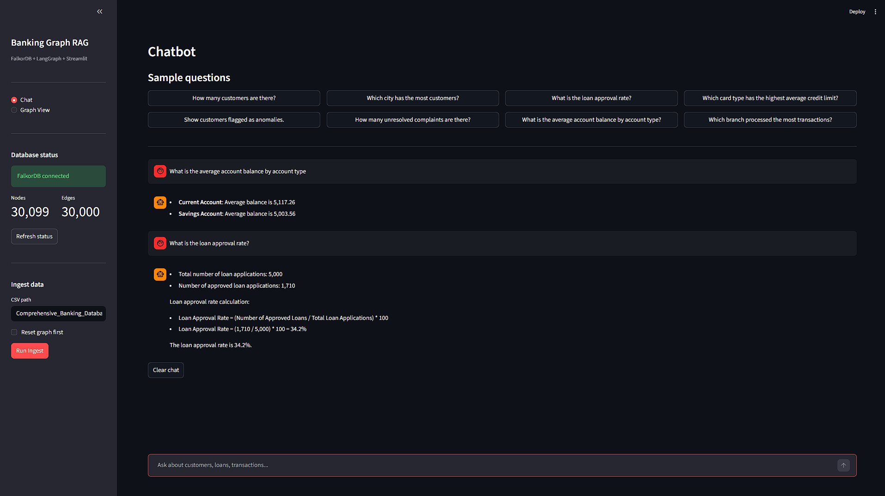

# Banking Graph RAG

A local, fully offline Graph Retrieval-Augmented Generation (RAG) chatbot built on **FalkorDB**, **LangGraph**, and **Streamlit**. Ask natural-language questions about customers, transactions, loans, credit cards, and feedback -- the agent automatically converts them into Cypher queries, runs them against the graph database, and returns grounded answers.

---
<image>


<image>
---

## Table of contents

1. [Architecture overview](#architecture-overview)
2. [Graph schema](#graph-schema)
3. [Project structure](#project-structure)
4. [Prerequisites](#prerequisites)
5. [Step-by-step setup](#step-by-step-setup)
6. [Running the app](#running-the-app)
7. [Using the chatbot](#using-the-chatbot)
8. [Using the graph explorer](#using-the-graph-explorer)
9. [Sample questions](#sample-questions)
10. [Configuration reference](#configuration-reference)
11. [Troubleshooting](#troubleshooting)

---

## Architecture overview

```
 User (browser)
      |
      v
+---------------------+
|    Streamlit UI      |   app.py
|  Chat | Graph View  |
+---------------------+
      |
      | natural-language question
      v
+---------------------+
|   LangGraph Agent   |   agent.py
|                     |
|  1. decompose()     |  -- splits question into 1-3 sub-questions
|  2. gen_cypher()    |  -- LLM generates Cypher per sub-question
|  3. execute()       |  -- runs Cypher against FalkorDB
|  4. gen_answer()    |  -- LLM produces grounded answer
+---------------------+
      |            ^
 Cypher query   results
      |            |
      v            |
+---------------------+
|     FalkorDB        |   Docker container (port 6379)
|   (graph DB)        |
+---------------------+
      ^
      | (one-time)
      |
+---------------------+
|     ingest.py       |  CSV --> nodes + relationships
+---------------------+
      ^
      |
+--------------------------------------+
| Comprehensive_Banking_Database.csv   |
| 40 columns, 7 entity types           |
+--------------------------------------+
```

### LangGraph agent pipeline

```
decompose
    |
    v
generate_cypher  <-- graph_schema.py (schema text + 30 few-shot examples)
    |
    v
execute          <-- FalkorDB (openCypher)
    |
    v
generate_answer  <-- OpenAI GPT-4o (grounded to DB results only)
    |
    v
  answer (str)
```

Each step is a **LangGraph node** sharing a typed `State` dictionary:

| State key     | Type        | Set by           |
|---------------|-------------|------------------|
| `question`    | `str`       | caller           |
| `history`     | `list[dict]`| caller           |
| `sub_queries` | `list[str]` | `decompose`      |
| `cypher_list` | `list[str]` | `generate_cypher`|
| `results`     | `list[str]` | `execute`        |
| `answer`      | `str`       | `generate_answer`|

---

## Graph schema

### Nodes

| Label         | Key property      | Important properties                                         |
|---------------|-------------------|--------------------------------------------------------------|
| `Customer`    | `customer_id`     | first\_name, last\_name, age, gender, city, email, anomaly  |
| `Account`     | `account_id`      | account\_type, balance, date\_opened, last\_transaction\_date|
| `Transaction` | `transaction_id`  | date, type, amount, balance\_after                           |
| `Branch`      | `branch_id`       | (identifier only)                                            |
| `Loan`        | `loan_id`         | amount, type, interest\_rate, term, status                   |
| `CreditCard`  | `card_id`         | card\_type, credit\_limit, balance, rewards\_points          |
| `Feedback`    | `feedback_id`     | date, type, resolution\_status, resolution\_date             |

### Relationships

```
(Customer)-[:HAS_ACCOUNT]      -->(Account)
(Customer)-[:MADE_TRANSACTION] -->(Transaction)
(Transaction)-[:AT_BRANCH]     -->(Branch)
(Customer)-[:HAS_LOAN]         -->(Loan)
(Customer)-[:HAS_CARD]         -->(CreditCard)
(Customer)-[:GAVE_FEEDBACK]    -->(Feedback)
```

### Entity-relationship diagram

```
Customer ----HAS_ACCOUNT------> Account
    |
    +---MADE_TRANSACTION------> Transaction ---AT_BRANCH---> Branch
    |
    +---HAS_LOAN--------------> Loan
    |
    +---HAS_CARD--------------> CreditCard
    |
    +---GAVE_FEEDBACK---------> Feedback
```

### CSV to graph mapping

The source CSV has **40 columns** mapped across 7 node types:

```
Customer ID, First Name, Last Name, Age, Gender,
Address, City, Contact Number, Email              --> Customer node
                                                      (+ Anomaly flag)

Account Type, Account Balance,
Date Of Account Opening, Last Transaction Date    --> Account node

TransactionID, Transaction Date,
Transaction Type, Transaction Amount,
Account Balance After Transaction                 --> Transaction node

Branch ID                                         --> Branch node

Loan ID, Loan Amount, Loan Type, Interest Rate,
Loan Term, Approval/Rejection Date, Loan Status   --> Loan node

CardID, Card Type, Credit Limit, Credit Card Balance,
Minimum Payment Due, Payment Due Date,
Last Credit Card Payment Date, Rewards Points     --> CreditCard node

Feedback ID, Feedback Date, Feedback Type,
Resolution Status, Resolution Date                --> Feedback node
```

---

## Project structure

```
banking_graph_rag/
|
|-- app.py                          # Streamlit UI (Chat + Graph View pages)
|-- agent.py                        # LangGraph multi-query RAG agent
|-- graph_schema.py                 # Schema text + 30 few-shot Cypher examples
|-- ingest.py                       # CSV --> FalkorDB ingestion script
|
|-- Comprehensive_Banking_Database.csv   # Source dataset (40 columns)
|-- .env                            # API keys and DB config (create this)
|-- requirements.txt                # Python dependencies
|-- README.md                       # This file
```

---

## Prerequisites

### Software

| Requirement   | Version  | Notes                                         |
|---------------|----------|-----------------------------------------------|
| Python        | 3.10+    | `python --version`                            |
| Docker Desktop| Latest   | For running FalkorDB locally                  |
| Git           | Any      | To clone the repo                             |


---


### 3. Install Python dependencies

```bash
pip install streamlit langgraph langchain langchain-openai \
            falkordb pandas requests tqdm python-dotenv
```

Or create `requirements.txt`:

```
streamlit
langgraph
langchain
langchain-openai
falkordb
pandas
requests
tqdm
python-dotenv
```

Then run:

```bash
pip install -r requirements.txt
```

### 4. Create the `.env` file

Create a file named `.env` in the project root:

```env
OPENAI_API_KEY=sk-...your-key-here...

FALKORDB_HOST=localhost
FALKORDB_PORT=6379
GRAPH_NAME=banking

LLM_MODEL=gpt-4o
```

### 5. Start FalkorDB with Docker

```bash
docker run -p 6379:6379 --rm falkordb/falkordb:latest
```

Leave this terminal running. FalkorDB is now available at `localhost:6379`.

To verify it is running:

```bash
# In a separate terminal
docker ps
# You should see falkordb/falkordb listed
```


## Tech stack

| Component    | Library / Tool                  | Role                            |
|--------------|---------------------------------|---------------------------------|
| UI           | Streamlit                       | Chat interface + graph explorer |
| Graph viz    | vis.js (via CDN)                | Interactive node/edge rendering |
| Agent        | LangGraph                       | Pipeline orchestration          |
| LLM          | LangChain + OpenAI GPT-4o       | Cypher generation + answering   |
| Graph DB     | FalkorDB (Docker)               | openCypher property graph       |
| Data loading | Pandas + falkordb Python client | CSV ingestion                   |
| Config       | python-dotenv                   | Environment variable management |


